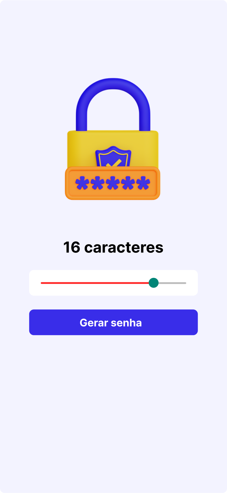
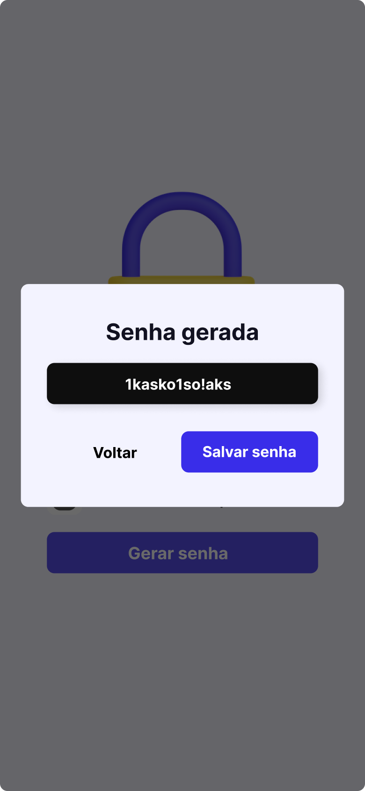
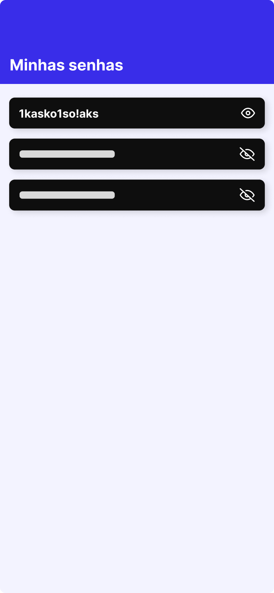

# Gerador de Senhas

Um aplicativo de gerador de senhas desenvolvido com **React Native**, utilizando **Expo** e a **navegação de páginas do React Native**. Este projeto foi desenvolvido como parte de um aprendizado prático com o Sujeito Programador.

## 🛠️ Funcionalidades

- Geração de senhas seguras e aleatórias.
- Navegação intuitiva entre páginas.
- Interface simples e amigável.
- Possibilidade de copiar senhas para a área de transferência.

## 🧰 Tecnologias Utilizadas

- **React Native**: Framework para criação de aplicativos móveis.
- **Expo**: Plataforma para desenvolvimento e teste de aplicativos React Native.
- **React Navigation**: Biblioteca para navegação entre telas.

## 🚀 Como Executar o Projeto

1. Certifique-se de que você possui o **Node.js** e o **Expo CLI** instalados em sua máquina.
2. Clone este repositório:
   ```bash
   git clone https://github.com/devsantx/gerador-senhas-react-native.git
   ```
3. Acesse o diretório do projeto:
   ```bash
   cd gerador-de-senha
   ```
4. Instale as dependências:
   ```bash
   npm install
   ```
5. Inicie o projeto no Expo:
   ```bash
   expo start
   ```
6. Abra o aplicativo em um dispositivo físico ou emulador utilizando o QR Code gerado.

## 🚀 Estrutura do Projeto:

- **src/app/\_layout.tsx**: Arquivo principal que gerencia a navegação entre telas.
- **src/components**: Contém os componentes e telas do aplicativo.
- **src/app/index.tsx**: Tela inicial para introdução ao gerador.
- **src/app/password.tsx**: Tela principal para gerar senhas.
- **assets/**: Recursos visuais do projeto.

## 🖼️ Demonstração

<div style="display: flex; gap: 20px;">
    
    
    
</div>


## 🤝 Agradecimentos

Este projeto foi inspirado e desenvolvido com base no tutorial do Sujeito Programador no YouTube. Agradeço pelo conteúdo detalhado e educativo, que permitiu a criação deste aplicativo.

## Contato

Se tiver dúvidas ou quiser discutir ideias e oportunidades, sinta-se à vontade para entrar em contato:

- **E-mail**: [kauansantana2721@gmail.com](mailto:kauansantana2721@gmail.com)
- **LinkedIn**: [linkedin.com/in/devsantx](https://www.linkedin.com/in/devsantx)
- **GitHub**: [github.com/devsantx](https://github.com/devsantx)

---

Este projeto é atualizado regularmente e faz parte do meu aprendizado contínuo. Obrigado por visitar e explorar meu trabalho!
